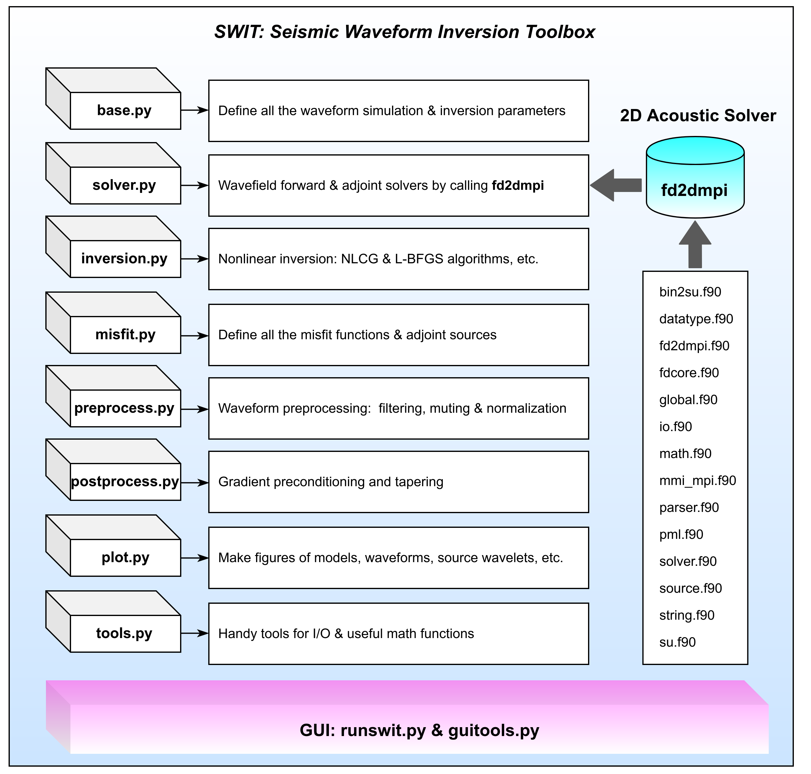

# **S**eismic **W**aveform **I**nversion **T**oolbox   (SWIT-1.0)

By Haipeng Li @ USTC

Contact: haipengl@mail.ustc.edu.cn





### SWIT Installation 

#### Step 1: Install  gfortran

```bash
# Install gcc and gfortran
sudo apt-get install build-essential
sudo apt install gfortran
```

#### Step 2 : Install OpenMPI

```bash
# Download the latest OpenMPI package, or go to  http://www.open-mpi.org/software/ompi to download the desired version
wget https://download.open-mpi.org/release/open-mpi/v4.1/openmpi-4.1.1.tar.gz 
tar xvfz openmpi-4.1.1.tar.gz
cd openmpi-4.1.1
# Configure the installation files and install OpenMPI (this would take quite a while)
./configure --prefix=/usr/local/openmpi CC=gcc FC=gfortran
make
sudo make install

# Add env path 
export PATH=/usr/local/openmpi/bin:$PATH
source ~/.bashrc

# Check OpenMPI is successfully installed
which mpirun
```

#### Step 3 : Install Anaconda Environment (Otherwise, just install Python dependencies as you like)

```bash
# Anaconda is recommended. For installing Anaconda, please refer to https://docs.anaconda.com/anaconda/install/linux/
# 1. download package from: https://www.anaconda.com/products/individual/download-success
# 2. bash ~/your_Anaconda_package

# Once the Anaconda is installed, create the conda environment for SWIT
conda create --name SWIT python=3.7.5
conda activate SWIT

# Install dependencies using USTC mirrors (whether use Anaconda or not)
pip install numpy obspy scipy matplotlib multiprocess PySimpleGUI psutil Pillow -i https://pypi.mirrors.ustc.edu.cn/simple/
```

#### Step 4 : Install & Run SWIT  

```bash
# Complie the fd2dmpi forward solver, edit the Makefile.config file, make sure FCC (line 18) is right 
cd ~/SWIT-1.0/fd2dmpi/
rm *.mod
make clean   
make

# Add fd2dmpi to the env path
export PATH=~/SWIT-1.0/bin:$PATH

# Add toolbox to the env path
export PYTHONPATH=~/SWIT-1.0/toolbox

# Source bashrc
source ~/.bashrc

# Run SWIT via GUI
cd ~/SWIT-1.0/toolbox/
python runswit_Linux.py    # or python runswit_MacOS.py 

# or Run SWIT via the Python script under the example folder
cd ~/example/some_case/
./run_workflow

# Notice:
# If you use the Intel Compiler
# You need to make the following change in forward and adjoint functions in toolbox/solver.py: 
# Change:     
#	solver_cmd = 'mpirun -np %d  fd2dmpi par=%s' % (mpiproc, parfile)
# to:
#   solver_cmd = 'mpiexec -np %d  fd2dmpi par=%s' % (mpiproc, parfile)
```

#### Systems  

```bash
SWIT-1.0 has been tested on Ubuntu 16.04, 18.04, 20.04, Centos 7.
It seems that SWIT-1.0 cannot run on MacOS properly due to the problem with the Python multiprocess module. This problem will be fixed in the future.
```

### FWI examples (keep updating)

| No.  | Acquisition |             Model              |     Size      | Optimization |
| :--: | :---------: | :----------------------------: | :-----------: | :----------: |
|  1   |    Land     |            Marmousi            | 481x121, 25 m |     NLCG     |
|  2   |    Land     |           Overthrust           | 401x101, 25 m |     NLCG     |
|  3   |   Marine    |            Marmousi            | 481x141, 25 m |     NLCG     |
|  4   |   Marine    |           Overthrust           | 401x121, 25 m |     NLCG     |
|  5   |    Land     | Marmousi from 1D initial model | 401x101, 25 m |     NLCG     |

### Citations :   

```
If you find SWIT is useful, please cite the following work:

1. Li, H., Li, J., Liu, B., Huang, X. (2021). Application of full-waveform tomography on deep seismic profiling dataset for tectonic fault characterization. International Meeting for Applied Geoscience & Energy.

2. Schuster, G. T. (2017). Seismic inversion. Society of Exploration Geophysicists. https://library.seg.org/doi/book/10.1190/1.9781560803423
```

